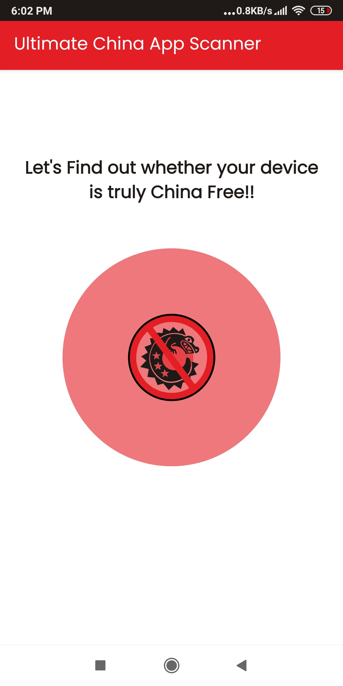
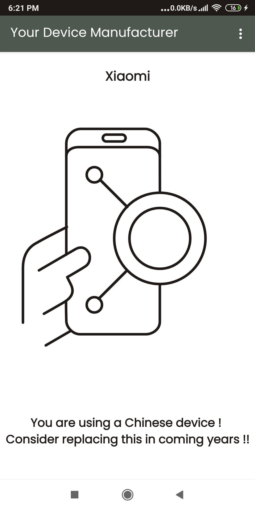
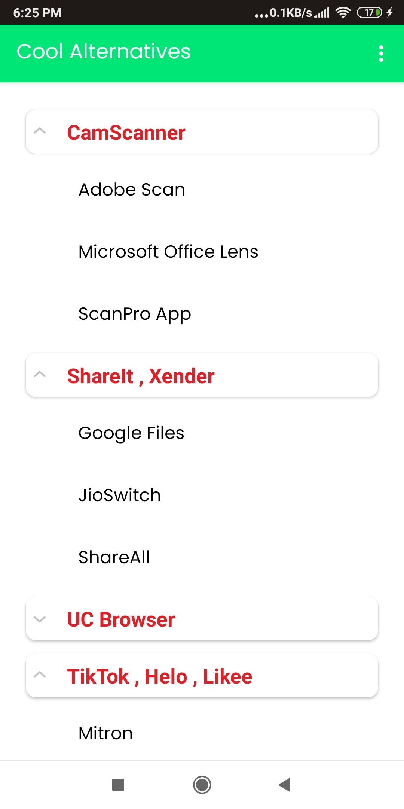
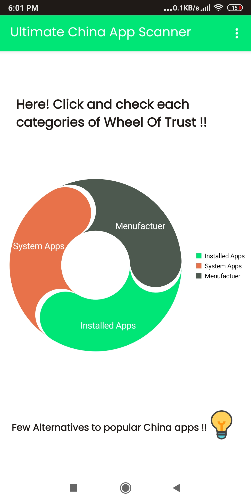
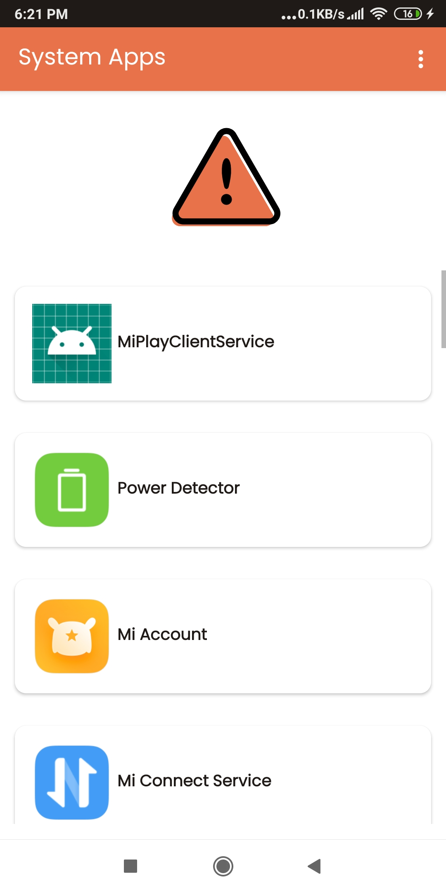
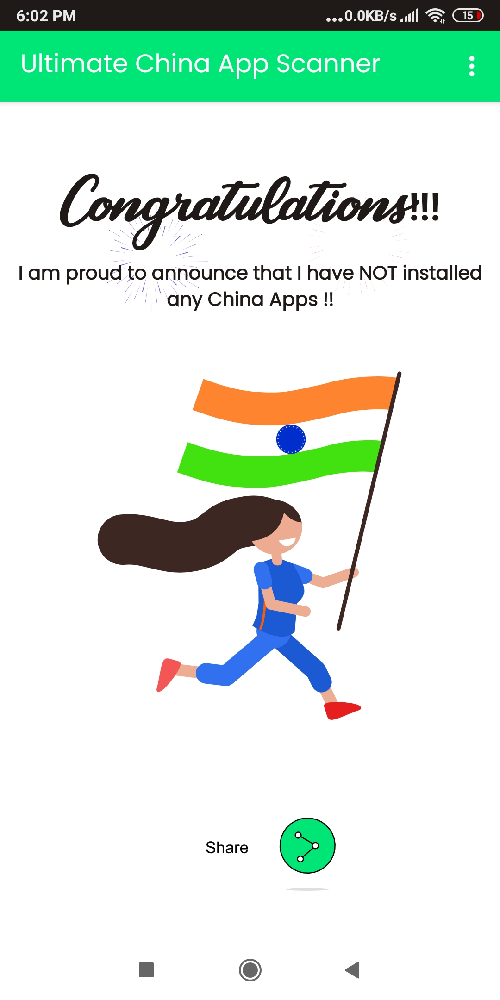

# UltimateChinaAppScanner

This app scans your device and enables you below features.

1. Lists popular user installed china apps and gives option to delete
2. Lists system apps
3. device manufacturer details whether it is from Chinese
4. Suggests cool alternatives for china apps
5. Cool animations and Circular chart for overall device status using first 3 categories

This App was released to Google Playstore but was rejected by Google due to new polycies introduced.

# Screenshots: ----------------------------------------------

